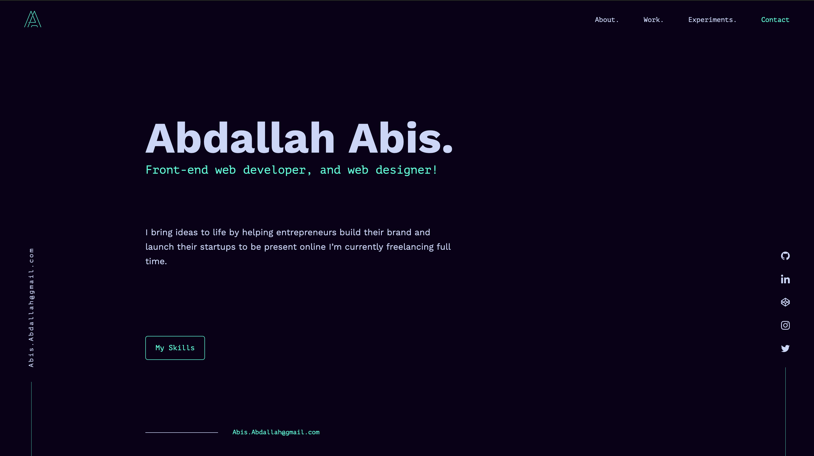

<p align="center">
  <a href="https://abisabdallah.com">
    
  </a>
</p>
<h1 align="center">
Abdallah Abis</h1>

<br />
<br />



<br />

<p>This Portfolio was designed and developed by <a href='https://twitter.com/Dev_abis' target="_blank">Abdallah Abis</a> using <a href='https://www.gatsbyjs.org/' target="_blank">GatsbyJS</a> and hosted on <a href='https://www.netlify.com/' target="_blank">Netlify</a>, the design was inspired by <a href='https://github.com/bchiang7' target="_blank">Brittany Chiang</a>,<strong> I hope you like it.</strong></p>


## :boom: Fork IT, BUT PLEASE MENTION ME:exclamation:


## 🛠 Installation & Set Up

1. Install the Gatsby CLI

   ```sh
   npm install -g gatsby-cli
   ```

2. Fork and/or clone this repo.

   ```sh
   git clone "github repo"
   ```

3. Install dependencies

   ```sh
   yarn
   ```

4. Start the development server

 ###### On Localhost

     ```sh
     gatsby develop
     ```
 ###### On Your Local Network

     ```sh
     yarn dev-local
     ```

## 🚀 Building and Running for Production

1. Generate a full static production build

   ```sh
   gatsby build
   ```

1. Preview the site as it will appear on production

   ```sh
   gatsby serve
   ```
